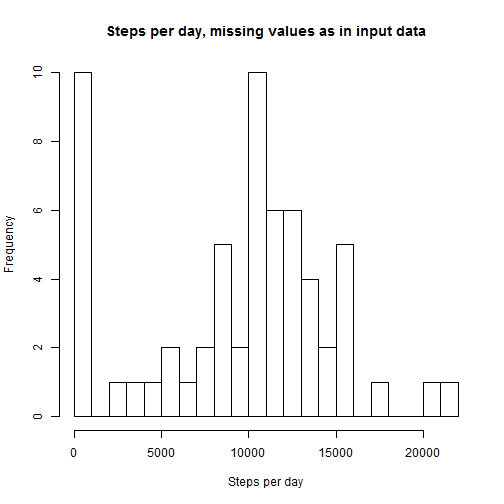
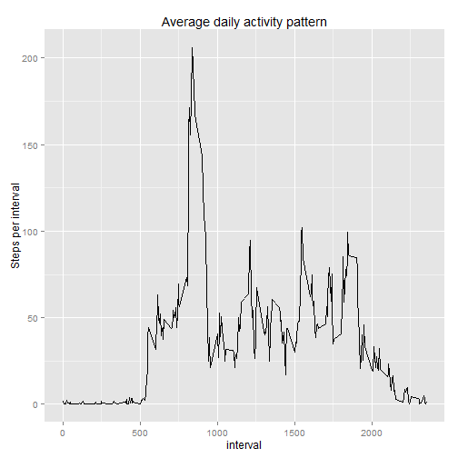
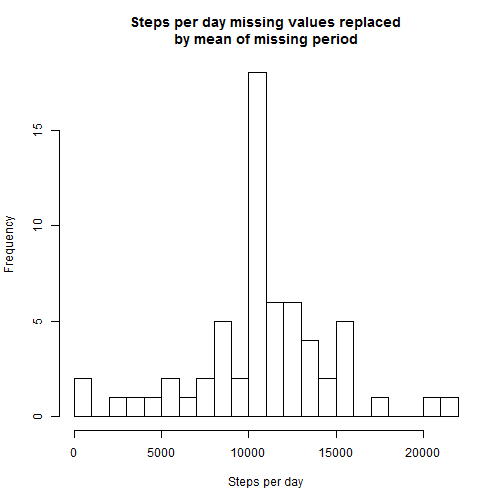
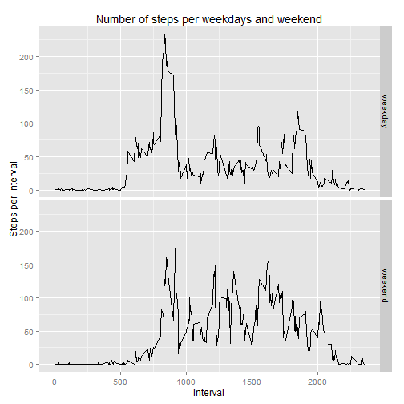

This is the Rmd document for Coursera Reproducible Research course, Peer Assignment 1

## Loading and preprocessing the data
To ensure the document is reproducable as a stand alone document, required packages are installed and the data is downloaded if missing.

```r
# Check if required packages are installed and install if needed. Attach dplyr & ggplot2
if (!"downloader" %in% installed.packages()) install.packages("downloader")
if (!"dplyr" %in% installed.packages()) install.packages("dplyr")
if (!"ggplot2" %in% installed.packages()) install.packages("ggplot2")
suppressPackageStartupMessages(library(dplyr))
library(ggplot2)

# Create and download directory + data if missing. unzip.
if (!dir.exists("./data"))
  dir.create("./data")
if (!file.exists("./activity.zip")) {
  downloader::download("https://d396qusza40orc.cloudfront.net/repdata%2Fdata%2Factivity.zip","activity.zip")
}
unzip("./activity.zip", exdir = "./data")

# read file and format date column as date
activity <- read.csv("./data/activity.csv", stringsAsFactors = F)
activity$date <- activity$date %>% as.Date()
```
  
  
## What is mean total number of steps taken per day?
The distibution of measured steps per day is plotted below.  

```r
sumPerDayDF <-
  activity %>% group_by (date) %>% summarise(sumPerDay = sum(steps, na.rm = T))

hist(
  sumPerDayDF$sumPerDay, breaks = 20, xlab = "Steps per day",
  main = "Steps per day, missing values as in input data"
)
```

 
  
A number of days, 8 have no measurements so the sum for those days is 0 steps.  
The mean steps per day is 9354 and the median
is 10395 steps per day.

  
## What is the average daily activity pattern?
The unmodified daily activity pattern is plotted below. Note that there's repeated chunks of missing values (the parts of the plot with straight lines).  
No compensation is made for the missing data.

```r
# Create dataframe w. mean steps per interval
meanPerIntvDF <-
  activity %>% group_by (interval) %>% summarise(meanPerIntv = mean(steps, na.rm = T))
# Plot daily averages
ggplot(meanPerIntvDF) + aes(interval, meanPerIntv) + geom_line() + ylab("Steps per interval") +
  ggtitle("Average daily activity pattern")
```

 
  
Interval number 835 is the most active interval with 
an average of 206 steps.
  
## Imputing missing values
There's missing values in the data, both rows with NA in steps column (2304 of them) 
and chunks of intervals missing for all days.  
The chunks of missing values is left unaltered, but the values steps == NA is replaced with mean step values for each missing period.


```r
# Create data frame with no missing values. 
activity_nomiss <- activity
# Replace NA with mean for the missing interval
activity_nomiss[is.na(activity_nomiss$steps),"steps"] <-
  meanPerIntvDF$meanPerIntv[match(activity_nomiss[is.na(activity_nomiss$steps),"interval"],
                                  meanPerIntvDF$interval)]
# Summarise steps per day in new data set
sumPerDayDF_nomiss <-
  activity_nomiss %>% group_by (date) %>% summarise(sumPerDay = sum(steps, na.rm = T))
# Plot the histogram
hist(
  sumPerDayDF_nomiss$sumPerDay, breaks = 20, xlab = "Steps per day",
  main = "Steps per day missing values replaced\nby mean of missing period"
)
```

 
  
When all NA-values is replaced with averages per interval, the mean changes to 
10766 and the median become
10766 steps.  
Since the 8 days with 0 steps is replaced with average values, 
both the mean and median is higher in the new data set.
  
## Are there differences in activity patterns between weekdays and weekends?
NA-values is removed rather than recalculated.  

```r
# Create factor wday for weekday/weekend and assign it with weekday
activity$wday <- factor("weekday", levels = c("weekday","weekend"))
# Assign weekend to all saturdays and sundays
activity$wday[strftime(activity$date, format = "%w") %in% c(6,0)] <- "weekend"
# Create summary of averages per interval and weekday/weekend. Skip NA-values
meanPerIntvDFw <- 
  activity %>% na.omit %>% group_by (interval, wday) %>% summarise(meanPerIntv = mean(steps, na.rm = T))
# Plot 2 plots by wday type
ggplot(meanPerIntvDFw) + aes(interval, meanPerIntv) + geom_line() + ylab("Steps per interval") +
  facet_grid(wday~.) + ggtitle("Number of steps per weekdays and weekend")
```

 
  
Weekdays have more activity early mornings, and weekends have more activity during mid day.
